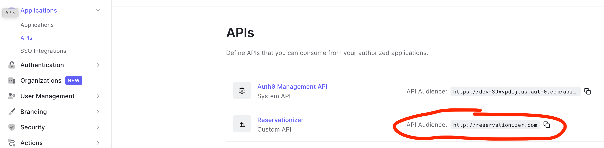
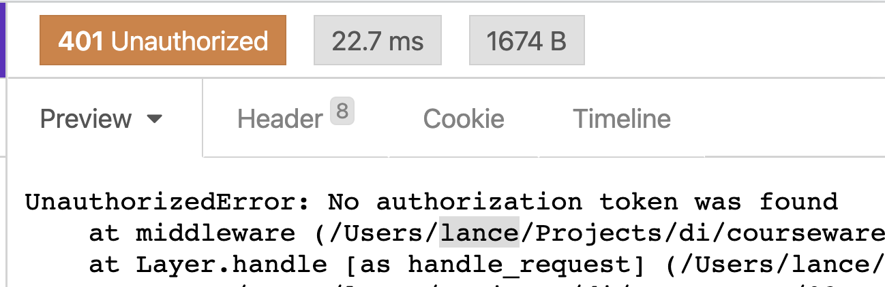
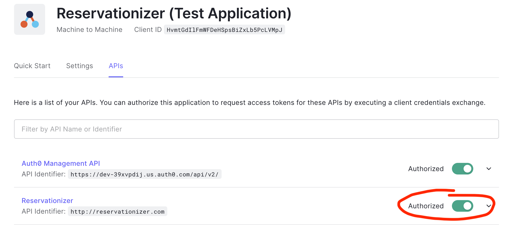
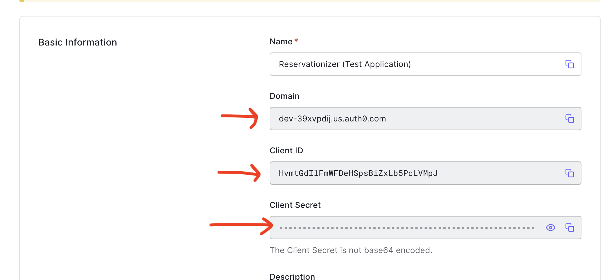
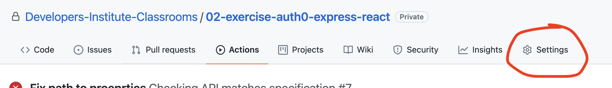
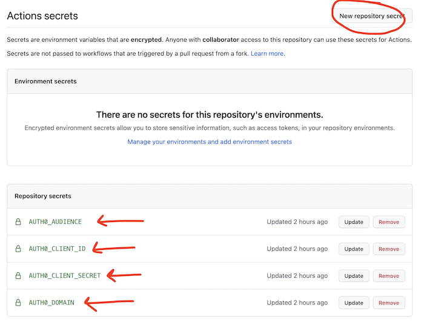
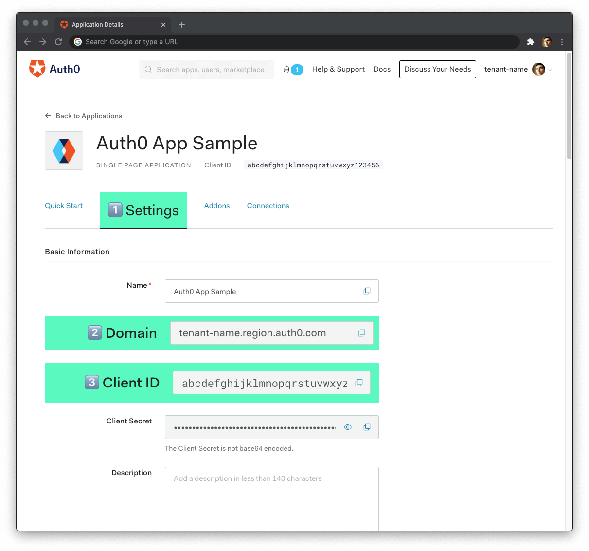
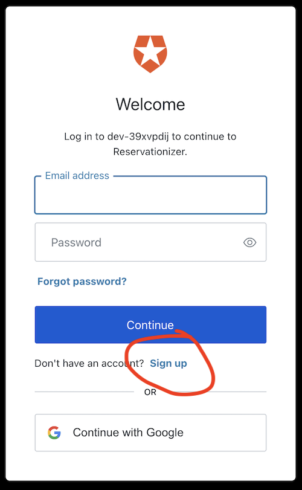

# 02 Exercise - Add Auth0 to your application

# Scenario

House Tricks have an online application where they can post properties for sale. Recently, some spambots have been creating property listings by filling in the form.

The form and API endpoint need to be secured, so only registered customers can list properties. 

Your Tech Lead has insisted you [Auth0](https://auth0.com/) implement authentication in your React application and Express server.

---

## Getting started

### Client

- Open a Terminal in VS Code for this project
- Type `cd client` to change directory into the client folder
- Type `npm install` to install npm dependencies
- Type `npm start` to start the Express Server

### Server

- Open a Terminal in VS Code for this project
- Type `cd server` to change directory into the server folder
- Type `npm install` to install npm dependencies
- Type `npm start` to start the Express Server

### Postgres Database

- In a new Terminal, type `docker-compose up` to start the Postgres DB server in a Docker container

---

# API specification

To view the documentation for the API specification:

1. Open a Terminal in VS Code for this project
2. Type `cd server` to change directory into the server folder
3. Type `npm run docs` to start a web server with API documentation
4. Open the link displayed in your browser (it's automatically copied to your clipboard)
   
   


## Load the API Specification in Insomnia

You can automatically load all the available endpoints in Insomnia.

Watch the [video tutorial](https://www.loom.com/share/dfaf8b47c6924f5ba04ce84dd1bdea1b), or follow the instructions below:

1. Go to the Insomnia Dashboard
2. Click the purple `Create` button
3. Select `File`.
4. Navigate into this exercise folder, and choose `server/e2e/api-spec.yml`.
5. Import as a `Request Collection`.
6. You can then open the House Tricks 1.0 Collection. Insomnia will load the endpoints for you.

---

# User Story

- As the real estate agent for House Tricks
- I want to add a new property to the website
- So potential customers can view and purchase the property

## Acceptance criteria

- Only logged in users can create new properties
- The person who created the property is captured on a `createdBy` field in MongoDB
- The person who created the property is included in the API response for properties (see the API specification)
- The API matches the API Specification

## Technical requirements

- [Auth0](https://auth0.com/) is used for authentication.

---

## 01 Instructions: Secure the Express route for creating a property

[Sign up for a free Auth0 account](https://auth0.com/signup)

Follow the [Node (Express) API: Authorization](https://auth0.com/docs/quickstart/backend/nodejs/01-authorization) tutorial to secure the `POST /properties` route. If you are logged in to your Auth0 account, the tutorial uses the correct values from your account in the code samples.

**Note:** You **do not** need to configure routes to look for permissions or a particular scope. Specifically, there is no need to use `express-jwt-authz`.

As you go through the tutorial, follow the guidelines below to ensure it works correctly:

1. For the API Identifier, you can put a made up URL
1. Put the `checkJwt` middleware before the `celebrate` middleware. This will ensure that the API first responds with a `401` if the user is unauthorised.
2. Set the value for `audience` to be the API Audience value displayed on the APIs page

   

3. Once configured, make a `POST` request in Insomnia. Your API should respond with a `401` status code and an error like this:

   

---

## 02 Instructions: Authenticate with Auth0 using Insomnia

1. Login to the Auth0 website. In the left sidebar, select Applications, and click Create application.
2. Create a new Machine to Machine application. In this case, Insomnia is one machine, and your Express server is the other machine. Name it whatever you like, `House Tricks`, for example.
3. In your Machine to Machine application, ensure you have selected your API in the API tab. The toggle should be green. **Note:** Your Application and API will be named something different from the screenshot.

   

4. Create environment variables in Insomnia, using the values from your Machine to Machine application. Follow this video tutorial to [Configure Auth0 Client Credentials in Insomnia](https://www.loom.com/share/04d0bc54e4fc4dc98fd1cffc6af2dee6).

---

## 03 Add Auth0 credentials to your Git repository

The automated tests in GitHub need to know your Auth0 credentials.

1. In Auth0, navigate to the Applications page, and open the machine to machine application. You will need the values of the following settings in the next steps.

   

2. Open your repository on GitHub, and click "Settings"

   

3. Choose `Secrets` from the left hand navigation

   

4. Click `New repository secret`. Create secrets with the following names and values:
   - `AUTH0_DOMAIN`: The domain from the application settings page in Auth0
   - `AUTH0_CLIENT_ID`: The client id from the application settings in Auth0
   - `AUTH0_CLIENT_SECRET`: The client secret from the application settings in Auth0
   - `AUTH0_AUDIENCE`: The value set for `audience` in your API in Auth0

      

--- 

## 04 Instructions: Capture who created the property

The API server can now identify who you are because you are providing an access token with your API requests. You need to capture this information in the MongoDB document, and display it in the API responses to match the [API specification](http://localhost:8888).

1. Update the Mongoose model to include a `createdBy` property, that is a required string
2. Ensure the `createdBy` property is returned in the API response by updating the `formatProperty` function and fix the tests that are now failing in `formatProperty.test.js`.

Now the model and responses are configured to account for the `createdBy` property, you need to add this information to the Mongoose document. 

As the `express-jwt` knows who the user is, it adds the user details to the request object. You can access them on `req.user`. 

It is convention that the unique identifier for the user is stored on a property named `sub`. 

Update the code in the `try` block in the `POST /properties` route to be the following:

```js
const { body, user } = req;
const document = {
   createdBy: user.sub,
   ...body,
};
const property = new PropertyModel(document);
await property.save();
return res.status(201).send(formatProperty(property));
```

This does the following:

1. Reads the user object off the `req`, that `express.jwt` added
2. Makes a new document object that will be saved to Mongoose. The [spread operator](https://www.w3schools.com/react/react_es6_spread.asp) combines one object with another. 
3. Passes this new document object into the Mongoose model
4. Saves this document into Mongoose
5. Responds with a `201` and the new document

Ensure your tests are passing by running `npm test`

Open Insomnia, and create a new property. You should see the `createdBy` field populated with a unique string that represents the user who created this request (your machine!).

In GitHub, the action should also pass for the `Checking API matches specification` tests. You can verify this by navigating to the `Actions` tab in your repository.

## 05 Instructions: Configure the React Application

1. Login to Auth0. In the left sidebar, select Applications, and click Create Application
2. Create a new Single Page Application. Name it `House Tricks`
3. View the settings of the application and set all URIs **except Application Login URI** to http://localhost:3000. **Make sure to save your changes!**
  - **Application Login URI**: Leave blank
  - **Allowed Callback URLs**: http://localhost:3000
  - **Allowed Logout URLs**: http://localhost:3000
  - **Allowed Web Origins**: http://localhost:3000
  - **Allowed Origins (CORS)**: Leave blank
4. In VS Code, open [`client/.env.development`](./client/.env.development). Populate the environment variables as follows, replacing the values with the values with your Auth0 client settings:
   - `REACT_APP_AUTH0_DOMAIN=tenant-name.region.auth0.com`
   - `REACT_APP_AUTH0_CLIENT_ID=abcdefghijklmnopqrstuvwxyz`

   

5. Populate the `REACT_APP_AUTH0_AUDIENCE` variable with the same value used for your `audience` in your Express Api. 
   - `REACT_APP_AUTH0_AUDIENCE=http://api-audience.com`

      

6. Restart your React Server to load the environment variables

Optional: Visit the Create React App documentation for [Environment Variables](https://create-react-app.dev/docs/adding-custom-environment-variables/) if you want to learn more about the `.env` file.

---

## 06 Instructions: Protect the Create Property route

The acceptance criteria state that only authenticated users are allowed to create new properties. You can configure your React Application to redirect users to a Login screen if they try to access that route when unauthenticated.

1. In VS Code, open [`client/src/App.js`](client/src/App.js)
2. Find the route that displays the `<AddProperty />` component
   
   ```jsx
   <Route path="/add">
      <AddProperty />
   </Route>
   ```

3. You will need to replace this with a protected route. `ProtectedRoute` is imported at the top of this file. The protected route is configured differently, where the path *and* components are passed in as properties. Replace the existing `<Route path="/add"><AddProperty /></Route>` with the following:

   ```jsx
   <ProtectedRoute path="/add" component={AddProperty} />
   ```

4. Now, open your React app in your web browser. Click the `Add Property` link in the header. You should be redirected to a login screen on Auth0.

---

## 07 Instructions: Create a user account on Auth0

When you see the login screen, you can click the Sign up button to create a new account. This will allow you to log in to your application and request an access token. You should be redirected back to your React Application after logging in.



---

## 08 Instructions: Send an access token with your API requests

Now you are authenticated with Auth0, you can get an access token that you can provide to the API.

1. In VS Code, open [`client/src/components/AddProperty.js`](client/src/components/AddProperty.js)
2. Auth0 provides some useful functions to get tokens. First, import Auth0 at the top of the file. Add the following code to the top of [`client/src/components/AddProperty.js`](client/src/components/AddProperty.js):

   ```js
   import { useAuth0 } from "@auth0/auth0-react";
   ```

3. Inside the `Create` function, add the following code, which is a function where we can get the access token

   ```js
   const { getAccessTokenSilently } = useAuth0();
   ```

4. Inside the `handleSubmit` function, put your cursor before the `fetch` request and add the following code. Auth0 will return an access token 

   ```js
   const accessToken = await getAccessTokenSilently();
   ```

5. You can use this token in your fetch request. Modify the headers in the fetch request to use this token:

   ```js
   const response = await fetch("http://localhost:5001/properties", {
      method: "POST",
      headers: {
         "Content-Type": "application/json",
         Authorization: `Bearer ${accessToken}`,
      },
      body: JSON.stringify(property),
   });
   ```

6. Now you are provided with the access token to the API, you can fill in the Add Property form, and you should see the new property at the bottom of the listing page.

---

# Submit your Exercise

- [ ] Commits are pushed to GitHub
- [ ] Automated tests pass in GitHub
- [ ] Exercise is submitted in Google Classroom
